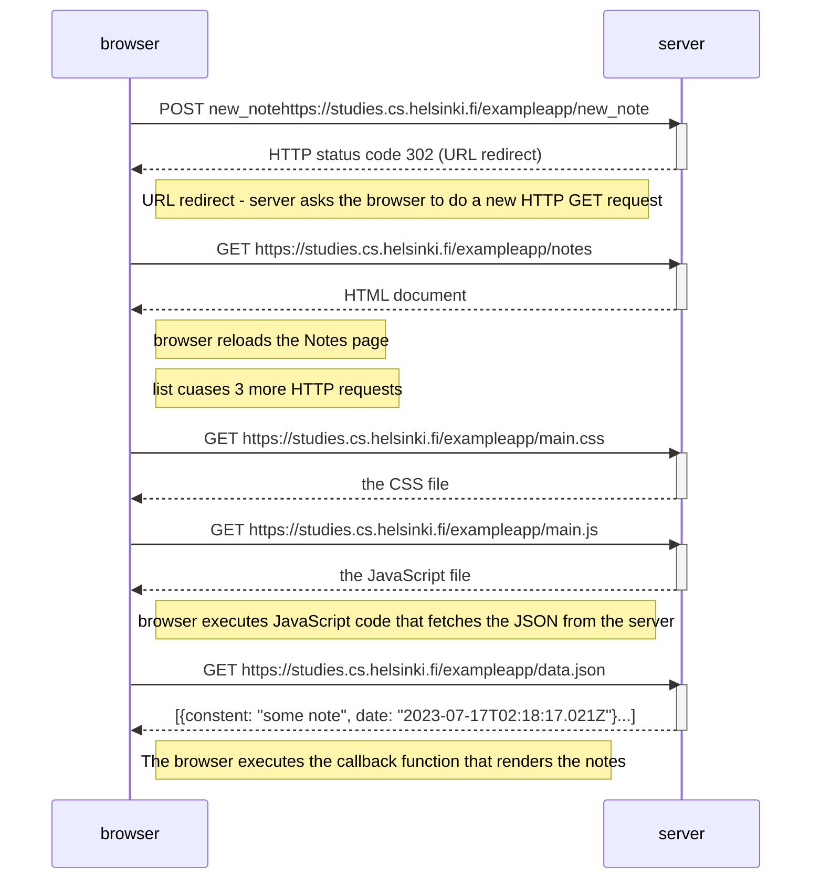

```mermaid
sequenceDiagram
participant browser
participant server

browser->>server: POST new_notehttps://studies.cs.helsinki.fi/exampleapp/new_note
activate server
server-->>browser: HTTP status code 302 (URL redirect)
deactivate server

Note right of browser: URL redirect - server asks the browser to do a new HTTP GET request

browser->>server: GET https://studies.cs.helsinki.fi/exampleapp/notes
activate server
server-->>browser: HTML document
deactivate server

Note right of browser: browser reloads the Notes page
Note right of browser: list cuases 3 more HTTP requests

browser->>server: GET https://studies.cs.helsinki.fi/exampleapp/main.css
activate server
server-->>browser: the CSS file
deactivate server

browser->>server: GET https://studies.cs.helsinki.fi/exampleapp/main.js
activate server
server-->>browser: the JavaScript file
deactivate server

Note right of browser: browser executes JavaScript code that fetches the JSON from the server

browser->>server: GET https://studies.cs.helsinki.fi/exampleapp/data.json
activate server
server-->>browser: [{constent: "some note", date: "2023-07-17T02:18:17.021Z"}...]
deactivate server

Note right of browser: The browser executes the callback function that renders the notes
```
