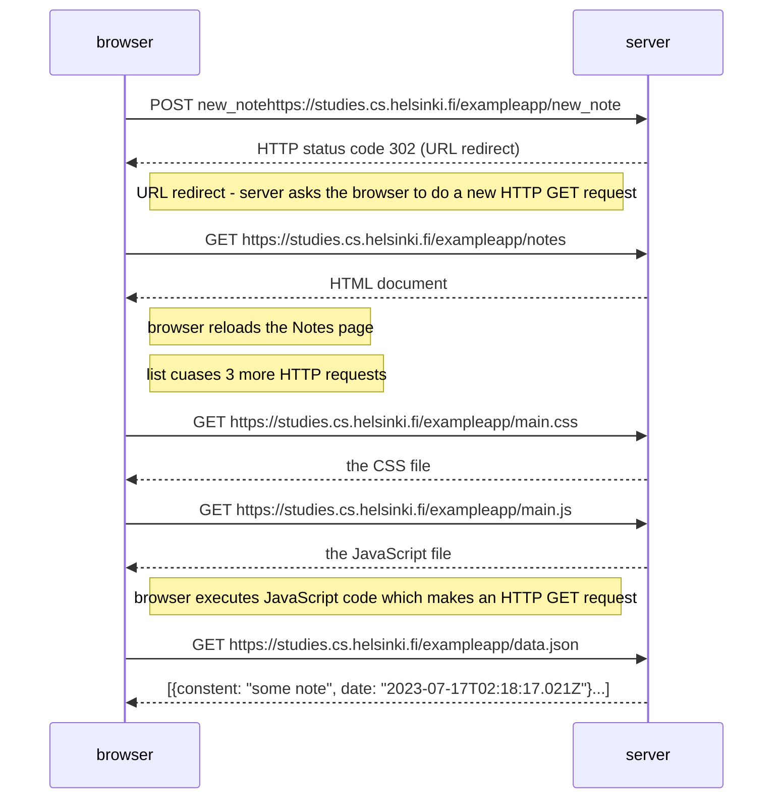

```mermaid
sequenceDiagram
browser->>server: POST new_notehttps://studies.cs.helsinki.fi/exampleapp/new_note
server-->>browser: HTTP status code 302 (URL redirect)
Note right of browser: URL redirect - server asks the browser to do a new HTTP GET request

browser->>server: GET https://studies.cs.helsinki.fi/exampleapp/notes
server-->>browser: HTML document
Note right of browser: browser reloads the Notes page
Note right of browser: list cuases 3 more HTTP requests

browser->>server: GET https://studies.cs.helsinki.fi/exampleapp/main.css
server-->>browser: the CSS file

browser->>server: GET https://studies.cs.helsinki.fi/exampleapp/main.js
server-->>browser: the JavaScript file
Note right of browser: browser executes JavaScript code which makes an HTTP GET request

browser->>server: GET https://studies.cs.helsinki.fi/exampleapp/data.json
server-->>browser: [{constent: "some note", date: "2023-07-17T02:18:17.021Z"}...]
```
