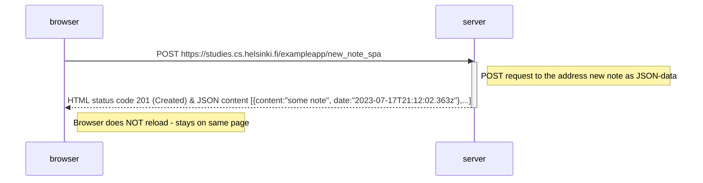

## What happens when a user creates a new note using the single-page version of the app 

```mermaid
sequenceDiagram

participant browser
participant server

browser->>server: POST https://studies.cs.helsinki.fi/exampleapp/new_note_spa
activate server
Note right of server: POST request to the address new note as JSON-data
server-->>browser: HTML status code 201  (Created) & JSON content [{content:"some note", date:"2023-07-17T21:12:02.363z"},...]
deactivate server


Note right of browser: Browser does NOT reload - stays on same page 
```
